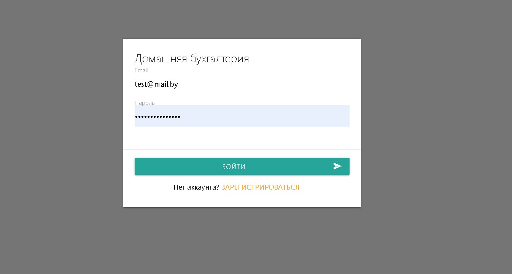
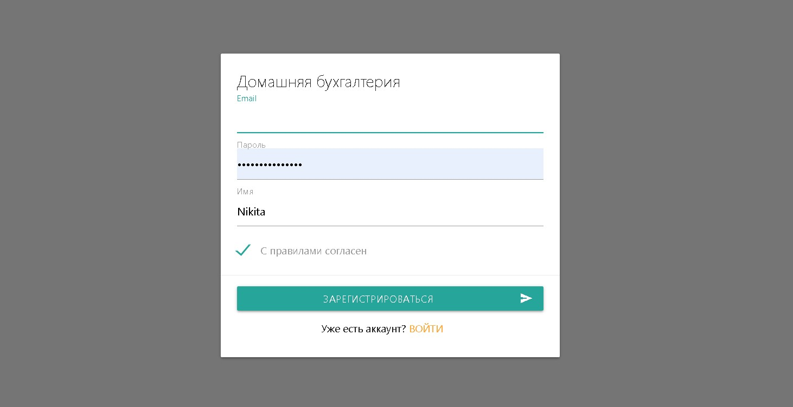

# CRM-VUE-CLI
______________________________________________________________
The app is written in Vue.js . 
This is a home accounting Department where you can keep a record of the financial resources spent for a particular period.
Also inside the app this is well shown in the diagram.

Working version and ready in the dev branch.
Branch master-for training, who wants...
______________________________________________________________

Authorization

______________________________________________________________
Registration

### Customize configuration
See [Configuration Reference](https://cli.vuejs.org/config/).
